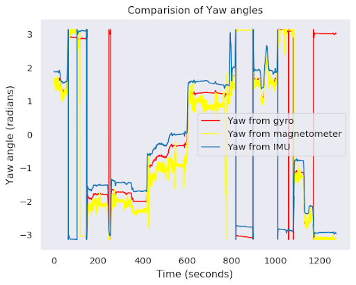

# Project Overview: VectorNav Sensor Fusion and Dead Reckoning

This project aims to implement sensor fusion techniques and perform dead reckoning using data from an Inertial Measurement Unit (IMU). The work is divided into two primary sections:

---

## Section 1: Yaw Angle Calculation with IMU Data

### A. Calibration of Magnetometer Data

In this phase, the yaw angle is determined using the magnetometer and gyroscope data provided by the IMU. The magnetometer data undergoes calibration to eliminate errors caused by hard and soft iron distortions. The steps involved in the calibration process include:

1. **Data Acquisition:** The IMU is rotated in a circular motion to capture the magnetic field data.
2. **Error Detection:** Two primary distortion factors, hard iron and soft iron effects, are identified.
3. **Correction of Data:** Adjustments are made to the magnetometer readings by shifting and reshaping the data to account for these distortions.

For a detailed walkthrough of the calibration and calculations, please refer to the accompanying Jupyter notebook.

### B. Estimating the Yaw Angle

The yaw angle is estimated using both the magnetometer and gyroscope data in the following manner:

1. **Yaw from Magnetometer:** The yaw angle is derived by calculating the angle between the corrected magnetic flux values in the X and Y axes.
2. **Yaw from Gyroscope:** Yaw is also calculated by integrating the angular velocity around the Z-axis.

To improve accuracy, a complementary filter is applied to combine both the magnetometer and gyroscope readings, ensuring a more reliable estimate of the yaw angle.

---

## Section 2: Dead Reckoning and Comparison with GPS Data

### A. Implementation of the Complementary Filter

The complementary filter is introduced to combine the advantages of both the magnetometer and gyroscope data:

- **Magnetometer:** Provides stable, long-term readings but is affected by high-frequency noise.
- **Gyroscope:** Offers precise short-term readings but suffers from drift over time.

By applying both high-pass and low-pass filters to the yaw data, the complementary filter yields a more accurate and reliable yaw angle estimation.

### B. Estimating Forward Velocity

Forward velocity is estimated by integrating the forward acceleration data from the IMU. This step involves removing the gravity component from the acceleration and correcting for any biases or errors in the measurements.

### C. Dead Reckoning

The next step is to perform dead reckoning, which involves the integration of the corrected velocity and angular velocity to compute both the distance traveled and the path covered by the IMU. The generated path is then compared with GPS data for validation:

- **Mapping:** The path generated from the IMU data is scaled, rotated, and aligned with the GPS data to assess the accuracy of the dead reckoning algorithm.
- **Error Analysis:** Discrepancies between the IMU-generated path and the GPS data are analyzed to understand the sources of error.

---

## Conclusion

The project successfully demonstrates the principles of sensor fusion and dead reckoning using IMU data. Key aspects of the work include accurate yaw angle estimation and forward velocity calculation. While the IMU-based dead reckoning provides a reasonable estimate of the path traveled, various factors such as sensor biases and errors during data integration contribute to some inaccuracies in the results.

For more in-depth plots, code, and calculations, please refer to the provided Jupyter notebook.
